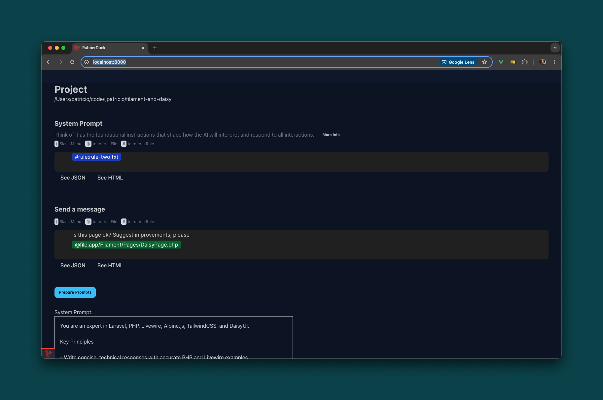

## Rubber Duck - AI

<p align="center">

</p>

Your rubber duck is a good listener. You can talk to it about your code, line by line.
Provide file contents, in bulk, file trees, give it custom operations, and it will listen to you!


## Launched because of a Live Stream

All is explained right here: https://blog.jpat.dev/launched-an-ai-application-open-source-free-bring-your-key

Video: https://www.youtube.com/watch?v=iMX-JWvlWI4

## Installation

```bash
cp .env.example .env
composer install
php artisan key:generate
touch database/database.sqlite
php artisan migrate:fresh --seed
npm install

# Run the development environment
composer dev
```
